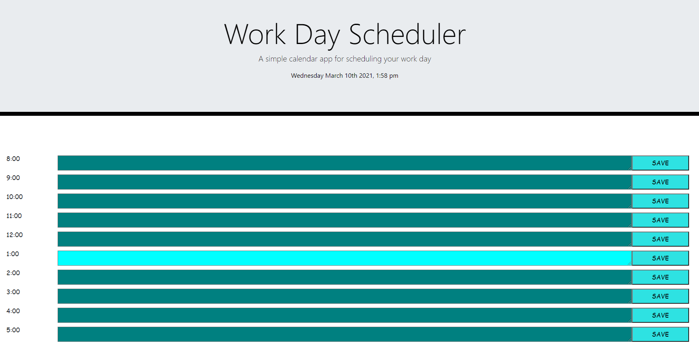

# Work-Day-Scheduler-React

  ## MIT License
  

  ## Description
  This is a work day scheduler that has been refactored using React. The app allows a user to set tasks for each hour of the day. These tasks will be saved in local storage so if the user leaves the page and returns later the tasks that were saved will still display.

  [🌴 CLICK HERE for the deployed app of Work-Day-Scheduler](https://jongudenzi.github.io/Work-Day-Scheduler-React/)
  
   

  

  ## Table of Contents

  * [Installation](#Installation)

  * [Usage](#usage)

  * [Contributing](#contributing)

  * [Tests](#tests)

  * [Questions](#Questions)

## Installation
To install necessary dependencies, run the following command:
 * npm i
 * npm start
 * npm run build
 * npm run deploy

## Usage
  User will type in a task for any hour of the day in the text field. Once the user is done setting the task they can click the save button. This will save the task in local storage so the user can come back later to view their tasks.

## Contributing
 * BootCamp Spot
 * BCS Tutor - Manuel Salcido
 * Ask BCS

## Tests
To run tests, run the following command:
  npm test

## Questions
If you have any questions please email me at  [jongudenzi@gmail.com](mailto:jongudenzi@gmail.com)

 

If you would like to see more of my work you can check out my GitHub profile at [GitHub Profile](https://github.com/JonGudenzi)
